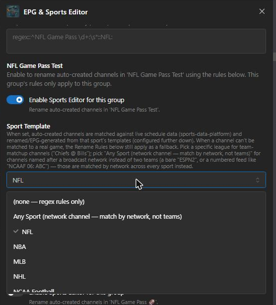
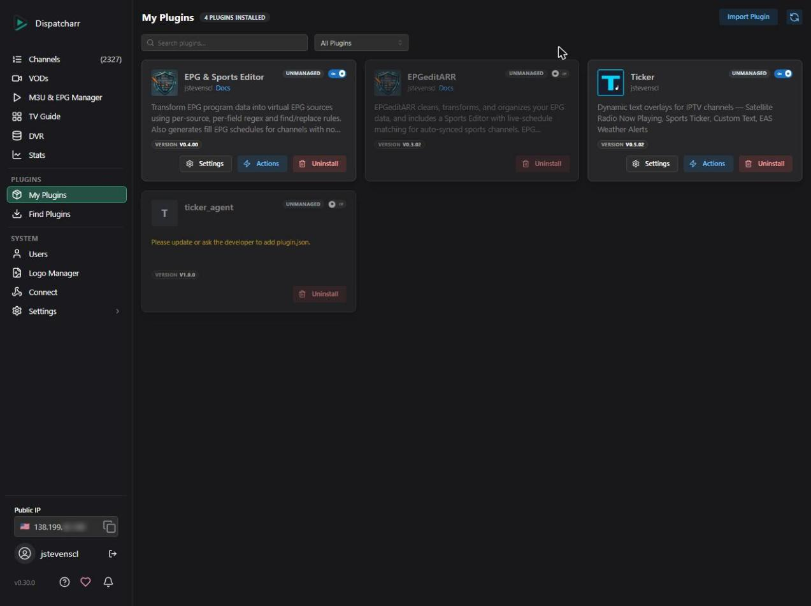
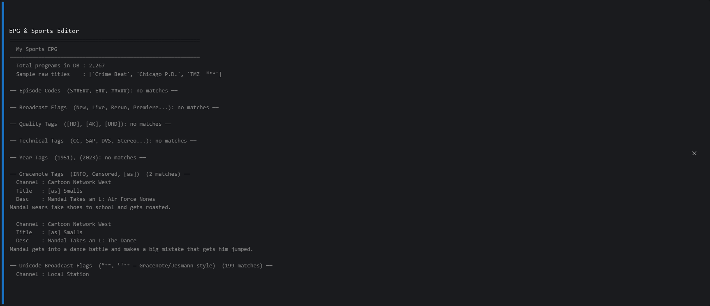
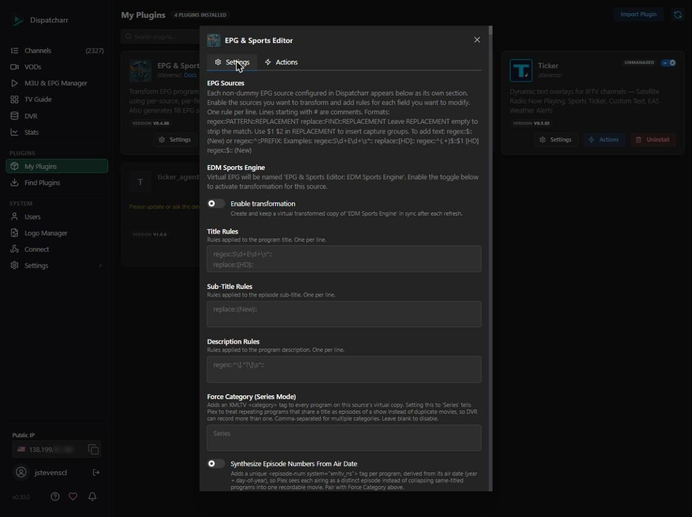
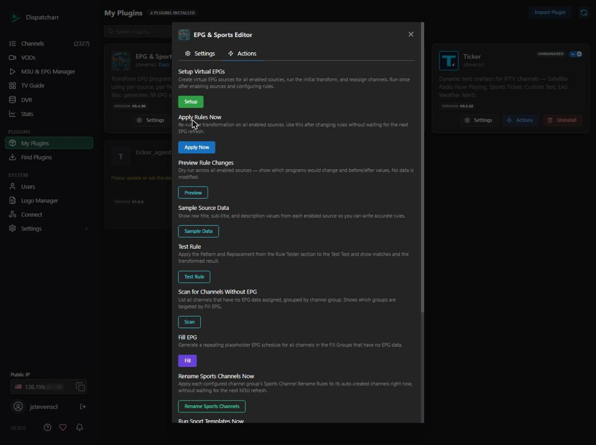

# EPG & Sports Editor

A [Dispatcharr](https://github.com/Dispatcharr/Dispatcharr) plugin that creates clean, transformed copies of your EPG sources, fills in missing EPG data, and includes a Sports Editor for auto-synced sports channel groups.

> **All SiriusXM/satellite radio functionality has moved.** EPG & Sports Editor no longer includes any SiriusXM tooling — channel Fill/Sort/Rename/Logo management, and the community SiriusXM EPG file, have both been removed. That functionality is now maintained in the [Ticker](https://github.com/jstevenscl/ticker) plugin, which sources channel/show data directly from StellarTunerLog's API and includes show schedules — a more advanced EPG than this repo's static file ever was. See the release notes for details.

> **Think of it as a filter layer between your raw EPG feed and what your players see.** Original sources are never touched.

---

## What It Does

### EPG Transformation

Many EPG sources contain noise in program titles and descriptions: broadcast flags, quality tags, episode codes, and other artifacts injected by the data provider.

| Raw title (what your EPG contains) | After EPG & Sports Editor |
|---|---|
| `The Daily Show  ᴺᵉʷ` | `The Daily Show` |
| `Breaking Bad S01E01` | `Breaking Bad` |
| `Movie Night [HD] (2019)` | `Movie Night (2019)` |
| `Live Sports [LIVE]` | `Live Sports` |

EPG & Sports Editor creates a virtual copy of your EPG source and writes the transformed programs there. Your channels are reassigned automatically. The original EPG is left untouched.

Per-source, you can also **Force Category (Series Mode)** and **Synthesize Episode Numbers From Air Date** — useful when an EPG's bare-bones programs (title/description only, no episode data) get treated as duplicate movies by Plex instead of recordable series episodes. See Settings Reference below.

### Fill EPG

For channels that have no EPG data at all, EPG & Sports Editor can generate a repeating placeholder schedule. This gives every channel at least a title block in your TV guide instead of a blank entry.

### Sports Editor

For channel groups that Dispatcharr's Auto Channel Sync populates automatically (e.g. an NFL Game Pass stream group), EPG & Sports Editor can rename the auto-created channels using a dedicated rule set — configured per channel group, separate from the EPG Sources rules above. It runs automatically right after each successful M3U refresh, and only ever touches auto-created channels, never manually-added ones.

Each channel group can also opt into **Sport Templates** (below) instead of, or alongside, plain rename rules — matching auto-created channels against a live public sports schedule and generating real channel names, logos, and a Pregame/Live/Postgame EPG from actual game data.

### Sport Templates

For groups with a Sport Template selected, EPG & Sports Editor fetches live schedule data from [sports-data-platform](https://api.tickarr.com) (a public feed shared across several sports-IPTV tools) and matches each auto-created channel against a real event in that sport, then — on a match — automatically:

- **Renames the channel** using a `{variable}`-driven template (e.g. `Denver Broncos @ Atlanta Falcons`, or `Alex Michelsen vs Taylor Fritz` for tennis)
- **Assigns a logo** via a matchup thumbnail/logo API ([sethwv/game-thumbs](https://github.com/sethwv/game-thumbs) — self-hostable, or use the public default instance) for team sports
- **Generates three EPG program blocks** around the real event time: Pregame, Live (event start through an estimated end based on the sport), and Postgame — each with its own title/description template, and with **configurable Pregame and Postgame windows** (how long before kickoff / after the game ends the channel keeps its game name and guide blocks)
- **Puts the same matchup image on those program blocks too** (v0.5.04+), not just the channel logo — as a programme-level `<icon>` in the generated XMLTV, so guide apps that prefer per-program artwork over the channel logo (Jellyfin, Plex) show the actual matchup image instead of generic placeholder art

**93 leagues are supported** — every major US team sport (NFL, NBA, MLB, NHL, NCAA Football, MLS, and dozens more including softball, volleyball, lacrosse, and NCAA variants), 30+ soccer competitions worldwide (Premier League, La Liga, Bundesliga, Serie A, Ligue 1, FIFA World Cup, and more), tennis (ATP/WTA), golf (PGA TOUR/LPGA), all three NASCAR series, Formula 1, UFC/MMA/boxing/darts, and a few niche sports (surfing, fishing). Two different matching engines run under the hood depending on the sport — team/individual matchup sports split the channel name into two competitors, while golf/NASCAR/F1-style sports match one descriptive event title instead — but this is automatic per sport, nothing to configure. See the **[Sport Templates Guide](docs/SPORT_TEMPLATES.md#full-league-list)** for the complete list.

All stored times are UTC (Dispatcharr's own timezone-neutral convention) — the schedule feed, matching windows, game start/end and every EPG block boundary; only the *text* in titles and descriptions is formatted for a timezone. Every variable is also available in a US Eastern/Central-formatted flavor (`{start_time_et_ct}`, etc., matching broadcast-standard convention for these leagues) and a plain UTC flavor (`{start_time_utc}`, etc.) side by side, so templates read correctly for viewers anywhere. An optional instance-wide **Local Display Timezone** setting (any IANA zone name) additionally unlocks a `{start_time_local}` flavor, DST-correct, for instances whose audience isn't US-based.

If a channel can't be confidently matched to a real game, the group's regular Rename Rules still apply as a fallback (or run standalone if no Sport Template is selected). See **Sport Templates Guide** below for the full setup walkthrough, variable reference, matching-engine caveats, and starter templates per league.

### Network Channels

Some providers name a channel after the broadcast network instead of two teams — a bare `ESPN2`, or a numbered regional-feed slot like `NCAAF 06: ABC` (common for out-of-market sports packages, where several numbered channels carry the same network because it airs a different game per region). Pick **Any Sport (network channel — match by network, not teams)** from the Sport Template dropdown for these:

- A channel already inside a specific-league group (e.g. `NCAAF 06: ABC` in an NCAA-football-only group) is matched by network **within that league** automatically — no separate setup needed, since the channel name doesn't parse as `Team @ Team` in the first place.
- A group of channels that could carry **any** sport during the day (a plain `ABC`, `ESPN2`, or `SEC Network` channel not sorted by league) should select **Any Sport** — matching then searches every league's events for one currently airing on that network, and renders it with that game's own sport's templates (so an ABC channel showing college football at noon and an NBA game at night each get the correct Pregame/Live/Postgame templates automatically).
- Network matching prefers whatever's live right now, otherwise the soonest upcoming game on that network. If a network genuinely carries two simultaneous games (common for ABC/CBS regional Saturday windows), there's no way to tell which numbered feed is which — the schedule feed doesn't carry regional-feed assignment — so a real tie is left unmatched rather than guessed at.



---



## Installation

### Recommended: Via Plugin Repository

1. In Dispatcharr, go to **Plugins → Find Plugins → Manage Repos → Add Repository**
2. Paste this URL:
   ```
   https://jstevenscl.github.io/epg-and-sports-editor/manifest.json
   ```
3. Click **Add Repo**, then find **EPG & Sports Editor** in the list and install it

### Manual Install

Copy `plugin.py` and `plugin.json` into your Dispatcharr plugins directory (any folder name works as of v0.4.06 — e.g. `epg-and-sports-editor` or `epg_and_sports_editor`) and reload plugins.

---

## Quick Start — EPG Transformation

### Step 1 — Find out what's in your EPG

Before writing any rules, use **Sample Data** to see what tags and patterns actually exist in your sources.

1. Open EPG & Sports Editor → **Actions tab**
2. Click **Sample Data**

The output groups programs by category (episode codes, broadcast flags, quality tags, unicode flags, etc.) and shows real before/after examples.



### Step 2 — Build your rules

Use the **[Rule Designer](https://jstevenscl.github.io/epg-and-sports-editor/designer.html)** to pick rules from a preset library or build your own. Copy the generated rules text when you're done.


Common presets:
- Episode codes (`S01E01`, `E05`, `1x05`)
- Broadcast flags (`(New)`, `(Live)`, `(Repeat)`, `[LIVE]`)
- Quality tags (`[HD]`, `[4K]`, `[UHD]`)
- Technical tags (`(CC)`, `(SAP)`, `(Stereo)`)
- Year tags (`(2023)`)
- Unicode broadcast flags (`ᴺᵉʷ`, `ᴸᶦᵛᵉ` — Gracenote-based providers)

### Step 3 — Enable a source and add rules

1. Open EPG & Sports Editor → **Settings tab**
2. Find the EPG source you want to clean
3. Toggle **Enable transformation** ON
4. Paste your rules into **Title Rules** (and/or Sub-Title / Description Rules)



### Step 4 — Preview (optional but recommended)

Click **Preview** in the Actions tab. Shows exactly which programs would change and the before/after values — no data is modified.

### Step 5 — Run Setup

Click **Setup** in the Actions tab. This:
- Creates a virtual EPG source (`EPG & Sports Editor: [Your Source Name]`)
- Transforms all programs and writes them to the virtual source
- Reassigns your channels to the virtual source automatically



From this point on, **every EPG refresh automatically re-runs the transformation**. You never have to touch Setup again unless you add a new source.

---

## Quick Start — Fill EPG

Fill EPG generates a repeating placeholder schedule for channels that have no EPG data.

### Step 1 — Configure Fill Groups

In **Settings → Fill EPG**, enter the names of the channel groups you want to fill (comma-separated). Example: `SiriusXM, Radio`.

Also set **Block Duration** (how long each placeholder program block is) and **Days Ahead** (how many days of schedule to generate).

### Step 2 — Scan to see what will be filled

Click **Scan** in the Actions tab. This shows all channels with no EPG data, grouped by channel group, and marks which groups are targeted by Fill EPG.

### Step 3 — Fill

Click **Fill** to generate the schedules. Channels in your Fill Groups that have no EPG get a repeating block schedule. This runs automatically after every EPG refresh.

---

## Quick Start — Sports Editor

> The Sports Editor operates per channel group — each channel group you enable gets its own Rename Rules, independent of every other group's rules.

### Step 1 — Set up Auto Channel Sync in Dispatcharr

In Dispatcharr's M3U account settings, enable Auto Channel Sync for the stream group you want (e.g. an NFL Game Pass group), and optionally target a dedicated channel group via the override option so auto-created channels land somewhere isolated from your production lineup.

### Step 2 — Enable the channel group in EPG & Sports Editor

In Settings, find the section for that channel group and toggle it on, then add Rename Rules (same `regex::`/`replace::` format as EPG Sources rules — see Rule Format below).

### Step 3 — Let it run automatically, or trigger it manually

After Dispatcharr's Auto Channel Sync creates channels on the next M3U refresh, EPG & Sports Editor renames them automatically — no manual step needed. To apply rule changes to already-existing auto-created channels without waiting for the next refresh, click **Rename Sports Channels Now**.

### Step 4 — (Optional) Turn on Sport Templates for real game data

Want real channel names, logos, and a Pregame/Live/Postgame EPG instead of just cleaned-up names? Pick a **Sport Template** from that same group's section in Settings. See the **[Sport Templates Guide](docs/SPORT_TEMPLATES.md)** for the full walkthrough — matching, variables, and starter templates per league.

---

## Actions Reference

| Button | What it does |
|---|---|
| **Setup** | First time you enable a source, or after adding a new source. Creates the virtual EPG and reassigns channels. |
| **Apply Now** | After changing rules — re-runs the transform immediately without waiting for the next EPG refresh. |
| **Preview** | Dry-run your current rules. Shows before/after for affected programs. No changes made. |
| **Sample Data** | Discover what tags/patterns exist in your sources. Run this before writing rules. |
| **Test Rule** | Test a single rule against live data from any source and field. Uses the Rule Tester settings. |
| **Scan** | List all channels with no EPG data, grouped by channel group. Shows which groups are targeted by Fill EPG. |
| **Fill** | Generate repeating placeholder EPG schedules for channels in your Fill Groups with no EPG data. |
| **Rename Sports Channels Now** | Apply each enabled channel group's Sports Channel Rename Rules to its auto-created channels right now, without waiting for the next M3U refresh. |
| **Run Sport Templates Now** | Match each Sport-Template-enabled group's auto-created channels against the live schedule right now — renames matches, assigns logos, and generates Pregame/Live/Postgame EPG data. |
| **Show Status** | Shows which sources are enabled, program counts, Fill EPG status, and configured rules. |
| **Teardown** | Removes all virtual EPG sources (including Fill EPG) and reassigns channels back to their originals. |
| **Restart Dispatcharr** | Reloads Dispatcharr's backend process so it picks up a plugin update — run this after every EPG & Sports Editor install/update. Not a full container restart; the page goes offline for about 15 seconds. |

---

## Rule Format

Rules go in the **Title Rules**, **Sub-Title Rules**, or **Description Rules** fields in Settings. One rule per line. Lines starting with `#` are comments.

### Regex rule
```
regex::PATTERN::REPLACEMENT
```
- `PATTERN` is a Python regex
- Leave `REPLACEMENT` empty to strip the match entirely
- Use `$1`, `$2` for capture groups (EPG & Sports Editor converts these to `\1`, `\2` internally)

### Find/replace rule
```
replace::FIND::REPLACEMENT
```
- Literal text match (not a regex)
- Leave `REPLACEMENT` empty to strip the match

### Swap title/sub-title rule (Title Rules only)
```
swap_subtitle::PATTERN::
```
- `PATTERN` is a Python regex matched against the program title
- When it matches, the program's Title and Sub-Title are swapped before any other rules run — so regex/replace rules below it still apply, to the swapped values
- Only valid in **Title Rules**; a plain `regex::`/`replace::` rule can't see across fields, so this is the way to move text between Title and Sub-Title
- The swap is skipped if Sub-Title is empty, so Title never goes blank
- **`^` and `$` mean the WHOLE title.** `swap_subtitle::^College Football$::` only matches a title that is exactly `College Football` — a trailing space (`College Football `) or extra words (`College Football Live`, `NCAA College Football`) will not match. If it isn't swapping, drop the anchors (`swap_subtitle::College Football::`) or allow whitespace (`swap_subtitle::^\s*College Football\s*$::`). A plain `replace::` rule matches the text *anywhere* in the title, which is why a find/replace can work when an anchored swap doesn't
- Use **Preview Rule Changes** to check: as of v0.5.00 it reports how many titles matched the pattern, how many would be swapped, and how many were skipped because their Sub-Title is empty (with the source's most common titles, quoted so stray spaces are visible, when nothing matched). Older versions always reported "0 changes" for a swap rule because the per-field preview can't see a swap. **Sample Data** shows a source's real Title / Sub-Title / Description values, which is the quickest way to see whether the matchup is actually in the Sub-Title (if it's in the Description, there is nothing to swap)

Useful when a source publishes a generic title (e.g. `College Football`) with the actual matchup in the sub-title, and you want them the other way around:
```
swap_subtitle::^College Football$::
```
Turns `Title: College Football` / `Sub-Title: Ohio State at Michigan` into `Title: Ohio State at Michigan` / `Sub-Title: College Football`.

**Only works if the source actually fills in the Sub-Title.** Some sources (e.g. **iptv-epg.org**) publish `<title>College Football</title>` with **no `<sub-title>` at all** and put the matchup on the first line of the description instead — `swap_subtitle` has nothing to swap for those and skips every program. Use `swap_description` (next section).

### Description-to-title rule (Title Rules only)
```
swap_description::PATTERN::
swap_description::PATTERN::EXTRACT_REGEX
```
- For sources where the real matchup is the **first line of the description**, e.g. a program with `Title: College Football` and `Description: "Texas at Tennessee⏎No. 14 Tennessee hosts No. 1 Texas…"`
- When the **title matches `PATTERN`**, the description's first line becomes the new **Title**, the old title becomes the **Sub-Title** (if it had none), and the rest of the description stays as the **Description**
- Optional `EXTRACT_REGEX` replaces "first line" when the matchup isn't on its own line: its first capture group is the new title and is removed from the description, e.g. `swap_description::College Football::^(.+? at .+?)\s{2,}` for a source that writes `Arizona at Washington State  Washington State welcomes…`
- A program is skipped if it has no description, no newline (and no `EXTRACT_REGEX`), or an extracted title over 150 characters (that's a paragraph, not a matchup)
- If a program does have a Sub-Title, `swap_subtitle` takes precedence for it; only one of the two fires per program. Regex/replace rules in Title, Sub-Title and Description Rules then run on the new values
- Example: `swap_description::College Football::` — works alongside **Force Category = Series** and **Synthesize Episode Numbers**, which are applied to the same virtual copy

### Examples

Strip episode codes from titles:
```
regex::S\d+E\d+\s*::
regex::\bE\d{2,3}\b\s*::
```

Strip broadcast flags:
```
regex::\s*\(New\)\s*::
regex::\s*\(Live\)\s*::
regex::\s*\[LIVE\]\s*::
```

Strip quality tags:
```
replace::[HD]::
replace::[4K]::
```

Strip unicode broadcast flags (Gracenote-style):
```
regex::\s{2,}(?:ᴺᵉʷ|ᴸᶦᵛᵉ|ᴾʳᵉ|ᴿᵉᵖ|ᴵⁿᶠᵒ|ᴼᵛᵉʷ)::
```

Strip a year from the end of a title:
```
regex::\s*\((19|20)\d{2}\)\s*$::
```

### Adding tags

Inject text by anchoring to the start (`^`) or end (`$`) of a field:

```
regex::$:: [LIVE]
regex::^::ESPN: 
```

Conditionally add `[LIVE]` only when the title contains the word "live":
```
regex::^(.*\blive\b.*)$::$1 [LIVE]
```

> **Tip:** Use the **Inject / Add Tags** preset group in the Rule Designer to build these without typing regex by hand.

---

## Settings Reference

### EPG Sources

Each EPG source in Dispatcharr gets its own section. Per-source settings:

| Setting | Description |
|---|---|
| **Enable transformation** | Toggle transformation on/off for this source |
| **Title Rules** | Rules applied to program titles. Also the only field that accepts `swap_subtitle::PATTERN::` to swap Title and Sub-Title — see Rule Format above. |
| **Sub-Title Rules** | Rules applied to episode sub-titles |
| **Description Rules** | Rules applied to program descriptions |
| **Force Category (Series Mode)** | Adds an XMLTV `<category>` tag to every program on this source's virtual copy. Setting this to `Series` tells Plex to treat repeating programs that share a title as episodes of a show instead of duplicate movies, so DVR can record more than one. Comma-separated for multiple categories. Leave blank to disable. |
| **Synthesize Episode Numbers From Air Date** | Adds a unique `<episode-num system="xmltv_ns">` tag per program, derived from its air date (year + day-of-year), so Plex sees each airing as a distinct episode instead of collapsing same-titled programs into one recordable movie. Pair with Force Category above. |
| **Auto-Reassign Channels on Setup** | Toggle channel reassignment on/off for this source |
| **Include Channel Groups** | Comma-separated group names — only these groups are reassigned |
| **Exclude Channel Groups** | Comma-separated group names — these groups are skipped |

### Fill EPG

| Setting | Description |
|---|---|
| **Fill Groups** | Comma-separated channel group names. Channels in these groups with no EPG get a generated schedule. |
| **Skip Channels** | One channel name per line. These channels are excluded from Fill EPG even if in a Fill Group. |
| **Block Duration** | Duration of each generated program block (1–24 hours). |
| **Days Ahead** | How many days of schedule to generate ahead (7, 14, or 30). |

### Sports Editor

One section appears per Dispatcharr channel group. Per-group settings:

| Setting | Description |
|---|---|
| **Enable Sports Editor for this group** | Toggle the Sports Editor on/off for this channel group |
| **Sport Template** | Pick a sport (93 supported — see the [full league list](docs/SPORT_TEMPLATES.md#full-league-list)), **Any Sport** for [Network Channels](#network-channels) (channels named after a broadcast network instead of two teams), or none, to match this group's auto-created channels against live game data instead of/alongside rename rules. See the **[Sport Templates Guide](docs/SPORT_TEMPLATES.md)**. |
| **Sports Channel Rename Rules** | Rules applied to auto-created channel names in this group. Same format as EPG Sources rules above, but a separate rule set per group. Used as a fallback when no Sport Template match is found (or always, if no Sport Template is selected). |
| **Hide auto-created channels with a past date in their name** | Off by default. For a channel that never matches a real game but whose raw name shows an already-past date/time, hide it (Dispatcharr's `hidden_from_output`, requires Dispatcharr v0.26.0+) instead of leaving it visible. Only ever un-hides a channel this feature itself hid. See the **[Sport Templates Guide](docs/SPORT_TEMPLATES.md#hiding-auto-created-channels-with-a-past-date-in-their-name-v0502)**. |

### Sport Templates

One section appears per sport. Each defines the templates used when a channel group with that sport selected matches a live game. Full variable reference and starter templates: **[Sport Templates Guide](docs/SPORT_TEMPLATES.md)**.

| Setting | Description |
|---|---|
| **Channel Name** | Renames the matched auto-created channel |
| **Logo URL** | Assigned as the channel's logo |
| **Pregame Title / Description** | EPG block from the start of the Pregame Window (below) through kickoff |
| **Live Title / Description** | EPG block covering the estimated game window |
| **Postgame Title / Description** | EPG block from the estimated end through the end of the Postgame Window (below) |

Global Sports Editor settings (one each, shared by every sport):

| Setting | Description |
|---|---|
| **Pregame Window (before kickoff)** | When the Pregame block starts. **All day** (default) = from midnight on game day in your Local Display Timezone (US Eastern if blank), but never less than 6 hours before kickoff; or choose a fixed **0 / 1 / 2 / 3 / 4 / 6 / 12 / 24 hours** before kickoff (0 = no Pregame block). Only affects the guide block — a game is matched and the channel renamed as soon as it appears in the schedule. |
| **Postgame Window (hours after the game ends)** | How long a matched channel keeps its game name, logo and a "Postgame" block after the game's estimated end: **0 / 1 / 2 / 3 (default) / 4 / 6 / 8 / 12 hours**. Once it passes, the game counts as finished — the next M3U refresh restores the provider's original name and the channel is no longer rewritten. |
| **Local Display Timezone (optional)** | Any IANA zone (e.g. `Pacific/Auckland`, `Europe/London`). Unlocks the `{start_time_local}` variables and sets the "midnight" used by the Pregame Window. Blank = US Eastern for the Pregame anchor. |
| **Game Thumbs Base URL** | Base URL of a [sethwv/game-thumbs](https://github.com/sethwv/game-thumbs) instance used by Logo URL templates via `{gamethumbs_base}`. Defaults to a publicly hosted instance — point this at your own self-hosted instance if you run one. |

---

## Rule Tester

The Rule Tester lets you test a single rule against live data from any source without modifying anything.

1. Go to **Settings tab** → scroll to **Rule Tester**
2. Select the source and field (Title, Sub-Title, or Description)
3. Enter a pattern and optional replacement
4. Click **Test Rule** in the Actions tab

You can also paste specific text into **Test Text** to test against that instead of pulling live data.

---

## Rule Designer

The **[Rule Designer](https://jstevenscl.github.io/epg-and-sports-editor/designer.html)** is a standalone web tool for building rules visually.

- Browse the preset library and add rules with one click
- Test patterns against sample text in real time
- Copy the finished rules text and paste into the plugin settings


---

## FAQ

**Do my original EPG sources get modified?**
No. EPG & Sports Editor only writes to the virtual (dummy) EPG sources it creates. Your original sources are read-only.

**What happens when my EPG refreshes?**
The plugin listens for Dispatcharr's EPG refresh completion signal. When a source you've enabled finishes refreshing, the transform and Fill EPG both run automatically.

**I added a new source after running Setup. What do I do?**
Enable the new source in Settings, add rules, then click **Setup** again. It's safe to run multiple times — it won't duplicate virtual sources or reassign already-correct channels.

**I changed my rules. Do I need to run Setup again?**
No — click **Apply Now**. Setup is only needed when adding a new source for the first time.

**Something looks wrong. How do I undo everything?**
Click **Teardown**. This deletes all virtual EPG sources (including Fill EPG) and reassigns your channels back to their original sources.

**Clicking Dispatcharr's own refresh icon (⟳) on an "EPG & Sports Editor: ..." row in M3U & EPG Manager gives an error about the source URL.**
Expected — EPG & Sports Editor's virtual/generated EPG sources (transform virtuals, Fill EPG, Sports Editor) intentionally have no URL, since EPG & Sports Editor writes their program data directly instead of Dispatcharr fetching it. Dispatcharr's native per-source refresh only knows how to fetch a URL, so it always fails on these with something like "Failed to download EPG data, cannot parse programs." This only flips that source's Status column to "Error" — it never touches your actual EPG data. Always use the plugin's own Actions tab buttons (**Apply Now**, **Fill**, **Run Sport Templates Now**) to refresh EPG & Sports Editor-managed data; running any of them restores the Status column to "Success."

**The unicode broadcast flags (`ᴺᵉʷ`, `ᴸᶦᵛᵉ`) show zero matches in Sample Data.**
These are provider-specific — not all EPG sources include them. Use Sample Data with each enabled source individually to find which one has them. They're typically found in Gracenote-sourced or aggregator feeds.

**I updated Dispatcharr and now plugin action buttons don't show any output.**
This is a known display-only regression, present since Dispatcharr v0.25.0 and still occurring as of v0.29.0. When you click an action button (Status, Fill, Run Sport Templates, etc.) the action runs correctly on the backend and all data is written — the result text just doesn't render in the modal UI. To confirm an action completed, click **Show Status** which will show current program counts and source state. All functionality continues to work normally. No change to EPG & Sports Editor is needed.

**My renamed channels / Sports Editor changes revert every time the M3U or EPG refreshes.**
Fixed in v0.4.02. Versions 0.4.00–0.4.01 had a bug where the plugin's internal settings lookup used the wrong key format, so its post-refresh hooks silently did nothing after every M3U/EPG refresh (manual **Run Sport Templates Now**/**Apply Now** still worked, since those don't depend on the broken lookup). Update to 0.4.02 or later — no settings changes needed.

**I get a "failed to update plugin settings: 400" error when I click an action button, even though the action itself works.**
Fixed in v0.4.03. Versions through 0.4.02 cached the fetched Sport Templates schedule data inside the plugin's own settings, which Dispatcharr's plugin UI silently re-uploads in full every time you click any action button. Once that cache grew large enough, the re-upload could be rejected, producing this error — even though the action you clicked ran and completed normally. Update to 0.4.03 or later; the schedule cache no longer lives in your settings, and any existing bloat is cleaned up automatically the next time the plugin loads. No settings changes needed.

**Channels get renamed and get EPG automatically after a refresh, but the matchup logos only appear after I click Run Sport Templates Now.**
Fixed in v0.4.05. The automatic post-refresh run had no fallback for the Logo URL template, so if you had never saved that field for a sport, no logo was assigned and the channel kept the stream's own logo — while the manual button (which supplies the built-in default) worked. The logo is now assigned from the sport's default template when you haven't customized it, and it's applied as the very last step of matching. No settings changes needed. (Note: leaving a Logo URL field blank now means "use the default", not "no logo".)

**Sports Editor / Sport Templates never run automatically after a refresh — only the manual buttons work.**
Fixed in v0.4.06. The post-refresh hooks looked up the plugin's saved settings under a single hard-coded key (`epg_and_sports_editor`), but Dispatcharr keys a plugin by its install *folder name* — so a manual install into a hyphenated folder (`epg-and-sports-editor`) silently found no settings and skipped everything. The plugin now derives its key from its own folder (and still accepts both spellings), and logs a warning if it can't find its settings. No settings changes needed.

**Some matched games show the teams backwards ("Home @ Away") or the wrong day's game in a series.**
Fixed in v0.4.06. The schedule feed carries a second broadcast-only row per game whose away/home order is usually reversed; when a channel name matched both rows equally, either could win. Matching now prefers the complete main row, then the row whose away/home order matches the channel name, then the game closest to now (so a series matches the upcoming game instead of one that already finished).

**A brand-new channel group doesn't appear in the Sports Editor settings until it already has channels.**
Improved in v0.4.06: groups with Auto Channel Sync enabled are now listed even before their first channels exist. Dispatcharr builds the settings form when the plugin loads, so use the plugins **Restart Dispatcharr**/reload after enabling Auto Channel Sync on a new group for it to show up.

**A channel gets its game name and logo, then goes back to the provider's original name after the game.**
That's by design: once a game's window has passed (estimated end + the **Postgame Window** setting), the game counts as finished, and the next M3U refresh restores the provider's name and stops rewriting the channel. Before v0.4.07 that window was a fixed 1 hour; it is now a setting (default 3 hours, up to 12) under Sports Editor → **Postgame Window**. A late-night check (e.g. 11:54 PM for an 8:00 PM game that ended 10:45 PM) used to look like "no match".

**How long does a game show as "Pregame"?**
Set by **Pregame Window** (Sports Editor settings). The default is "all day" — from midnight on game day in your **Local Display Timezone** (US Eastern if that's blank), but never less than 6 hours before kickoff. Earlier versions anchored "midnight" to UTC, so a game kicking off just after UTC midnight (e.g. 8:00 PM US Eastern) got almost no pregame while a 7:00 PM one got ~23 hours. Pick a fixed number of hours if you want the same length for every game regardless of timezone.

**"NCAA Football" and "NCAAF" both show up as Sport Templates — which one should I pick?**
Either, as of v0.4.07. The schedule feed publishes college football under two slugs: `ncaaf` (the real ESPN scoreboard) and `ncaa-football` (an ESPN+ *watch* feed that is mostly studio/replay programming). Earlier versions matched only the slug you picked, so "NCAA Football" matched almost nothing. Both templates now search both feeds and prefer the real scoreboard game.

**Channels named like `NCAAF01: 7:30PM NC State at Wake Forest`, `(Apple) (MLS) 031 | Vancouver vs. D.C. (Spanish)` or `US - NHL GAME 03 : DALLAS STARS @ MINNESOTA WILD SEP 25 - 8:00 PM ET` didn't match.**
Fixed in v0.4.07. Provider tags, game numbers, times, dates, rankings (`#15`), language/feed notes and underscores (`New_York_City`) are now stripped from each team's text before matching — from the *start* of the away side and the *end* of the home side only, so real team names (`Miami (OH)`, `49ers`, `Bayer 04 Leverkusen`) are never altered.

**A channel was renamed to the wrong game.**
Fixed in v0.4.07. Team matching used to accept any 60%-similar text, so words like "State" or near-identical abbreviations (`NYR`/`NYI`) could match an unrelated game when the real one wasn't in the schedule yet. Matching now compares whole words — a partial name must be a whole-word prefix or suffix (`Vancouver` → `Vancouver Whitecaps`, but `Tennessee` no longer matches `Middle Tennessee`) — and fuzzy spelling matches need to be near-identical. Very loose abbreviations (`Man Utd`) may no longer match; a missed match is safer than renaming the wrong game. TV-show rows from the watch feed (`SEC Inside: Auburn`) are also ignored.

**The Sports Editor EPG source shows "error — Failed to download EPG data" but my guide is fine.**
Fixed in v0.4.07. Linking a channel to the plugin's generated EPG made Dispatcharr queue a file-parsing job that can't succeed for a source with no file, and it stamped the source with an error. The plugin now links channels without triggering that job, and also clears Dispatcharr's cached guide output after writing programs (previously the XMLTV guide could keep serving old titles after a program change).

**College football channels named `SC State`, `Southeastern Louisiana` or `Grambling State` don't match, though the game is on ESPN.**
Fixed in v0.4.08. Providers and ESPN spell the same school differently (`Southeastern Louisiana` vs ESPN's `SE Louisiana`, `SC State` vs `South Carolina State`, `Grambling State` vs `Grambling`, `Penn` vs `Pennsylvania`). Matching now includes a general alias step — common short/long forms (`SE`/`Southeastern`, `SC`/`South Carolina`, `St`/`State`/`Saint`, `Penn`/`Pennsylvania`, `UMass`, `Pitt`, …) and an optional trailing "State" — scored just below a real name match, so a genuine match always wins. An alias is only accepted when the other team in the game is a real match, and never when a real team with that name plays in the same window (so `Colorado State` is not aliased onto `Colorado` while a real Colorado State game exists). One-word, four-letter-or-shorter feed names such as `IOWA` or `OHIO` now match by equality only (`Northern Iowa` no longer matches `IOWA`).

**College football games matched but show no logo.**
Fixed in v0.4.08. game-thumbs doesn't recognize some of ESPN's team abbreviations (e.g. `MTSU`, `JVST`, `AFA`, `NEV` return HTTP 400 "Team not found") but does recognize full team names, so for `NCAAF` / `NCAA Football` the default Logo URL now uses each team's full-name slug. Other leagues keep using the abbreviation. A few very small schools (e.g. Rio Grande) aren't in game-thumbs at all and can't get a logo.

**A game that only exists in the ESPN+ watch feed was named backwards ("Home @ Away").**
Fixed in v0.4.08. For US leagues the watch feed lists home and away in the opposite order of the real scoreboard (college football 61 of 61 games, NHL 35 of 37 — but not soccer). The plugin now measures this per league from the feed itself and corrects the reversed leagues, so a watch-only game comes out in the provider's own order.

**Small-school (FCS and below) college games were missing from the schedule.**
Until 2026-09-26 the schedule feed only carried the top college division (FBS), so FCS-vs-FCS games such as Harvard–Brown or Yale–Cornell had nothing to match. The feed now includes the FCS; if you still see a game missing, check that your plugin is v0.4.08 or later and that the channel's team names match ESPN's (the alias step above covers the common spelling differences).

**`swap_subtitle::^College Football$::` in Title Rules does nothing, and Preview says 0 changes.**
Two separate things. (1) Preview could not show swaps before v0.5.00 — it always said "0 changes" for a `swap_subtitle` rule, and it only scanned the first 2,000 programs; it now scans up to 50,000, reports matched / would-swap / skipped counts, and explains a non-match. (2) `swap_subtitle` only swaps when the title matches **and** the program has a non-empty Sub-Title. **Many sources — iptv-epg.org for one — publish no Sub-Title and put the matchup on the first line of the description**, so `swap_subtitle` skips every program however the pattern is written (anchors, spaces and downgrading make no difference). Use the new `swap_description::College Football::` rule (v0.5.00+) instead: it takes the description's first line as the new Title and keeps the old title as the Sub-Title. Preview tells you which case you're in. See [Swap title/sub-title rule](#swap-titlesub-title-rule-title-rules-only) and [Description-to-title rule](#description-to-title-rule-title-rules-only).

**A channel like `NCAAF 06: ABC` or a plain `ESPN2` never matches, even though the sport is enabled.**
That channel name has no `Team @ Team` shape at all, so the normal matchup matcher has nothing to parse — it needs [Network Channels](#network-channels) (v0.5.00+) instead. If it's inside a specific-league group, no extra setting is needed (it's tried automatically once the matchup parse fails); for a channel that isn't tied to one league, set that group's Sport Template to **Any Sport**. If it still doesn't match, check that the channel name actually contains a recognizable network code/name (`ABC`, `ESPN2`, `SEC Network`, etc.) and that a game is genuinely airing on that network within the matching window — an empty broadcast network on SDP's feed (see the FCS/no-network FAQ entries above) looks the same as no match. **A game that already ended is also treated as no match on purpose** (see [step 5 of the matching engine](docs/SPORT_TEMPLATES.md#the-matching-engine-explained)) — a channel showing yesterday's matchup won't update until your provider refreshes it to today's game.

**A provider's numbered or "ALT" second feed of a network (`BIG TEN NETWORK 2`, `BIG TEN NETWORK ALT`, etc.) doesn't get recognized as a Network Channel.**
Fixed in v0.5.01 (numbered feeds) and v0.5.06 (`ALT`/`ALTERNATE` feeds). SDP's data only carries one code per network (`BTN`, not a separate `BTN2` or `BTN ALT`) — a provider's own regional/alternate-feed marker is stripped before matching a network name, so `BIG TEN NETWORK 2` and `BIG TEN NETWORK ALT` both resolve to the same `BTN` as `BIG TEN NETWORK`. Doesn't apply to networks whose code genuinely ends in a digit with no space before it (`ESPN2`, `FS1`) — those are unaffected and still match directly.

**`{feed_line}` (or the HOME/AWAY/NATIONAL feed tag) renders empty even though the provider clearly splits Home/Away feeds.**
Fixed in v0.5.01. Some providers put a literal `@` between the feed tag and the date (`... HOME @ 27 Sep 01:05 PM ET`) instead of a plain space (`... HOME 23 Aug 01:35 PM ET`, the shape this was originally built against) — the `@` broke the tag detection, so `{feed_tag}`/`{feed_line}` came back blank. Both shapes now work the same way.

**A channel matched the wrong date — same two teams, but a game days away instead of the one named in the channel's own text.**
Two fixes for the same symptom. (1) v0.5.02: when the correct date's game *and* a same-teams rematch were both still inside the matching window (a home-and-home, or a best-of playoff series), the tie-break let "which row's team order matches" outrank "which date is closest to right now" — fixed by checking date proximity first. (2) v0.5.05, a deeper case: a *stale* channel whose own named game had aged completely out of the window had no correct candidate left at all, so an unrelated future rematch won by default. Now, whenever the channel's raw name has a parseable date (most provider formats embed one), a match whose real date disagrees by more than 36 hours is rejected outright rather than trusted — see [the matching engine](docs/SPORT_TEMPLATES.md#the-matching-engine-explained) for the details.

**Can a stale numbered channel showing yesterday's game be hidden until the provider refreshes it?**
Yes, as of v0.5.02 — turn on **Hide auto-created channels with a past date in their name** for that group. See [the Settings Reference](#sports-editor) above and the **[Sport Templates Guide](docs/SPORT_TEMPLATES.md#hiding-auto-created-channels-with-a-past-date-in-their-name-v0502)** for how it decides and how un-hiding works.

**I'm far ahead of US time zones (e.g. New Zealand) — will "Hide auto-created channels with a past date" hide a channel too early for me, since my calendar date is already a day ahead?**
No. The comparison is done entirely in real UTC time, using the time zone written in the channel's own name (`ET`/`CT`/`MT`/`PT`) — not your local clock, and not the plugin's **Local Display Timezone** setting. `SEP 27 8:50 PM ET` becomes one specific real-world instant, the same instant everywhere on Earth, and hiding only happens once that much real time has actually elapsed (plus a small grace buffer) — never based on "has the calendar date passed" for whoever's looking at it. See the **[Sport Templates Guide](docs/SPORT_TEMPLATES.md#hiding-auto-created-channels-with-a-past-date-in-their-name-v0502)** for the full explanation.

**A Sunday/Monday/Thursday Night Football channel doesn't match.**
Fixed in v0.5.03 for the `4K - SNF`/`HD MNF:`/bare `TNF` shape (e.g. `NFL | 4K - SNF 8:20pm Rams at Broncos`) — a resolution tag plus prime-time broadcast-slot code wasn't recognized as noise, so it stuck to the team name and matched nothing. This isn't a weakness in same-day matching or the scoring engine itself — it's specifically that noise-stripping only recognizes provider decoration it's already seen. If you hit a genuinely new unrecognized shape, **report the exact raw channel name** rather than assuming it can't be fixed; every format added stays fixed going forward. See [the matching engine](docs/SPORT_TEMPLATES.md#the-matching-engine-explained) for the full list of what's already handled.

**Where did SiriusXM channel management go?**
It's been removed from EPG & Sports Editor as of this version — see the note at the top of this README and the release notes. Active SiriusXM development (Now Playing overlays, logos, and a more advanced EPG) is now in the [Ticker](https://github.com/jstevenscl/ticker) plugin.

---

## Credits & Attribution

- **Sport Templates UX** — the per-sport Channel Name / Logo URL / Pregame / Live / Postgame template design was inspired by [Pharaoh-Labs' Teamarr](https://github.com/Pharaoh-Labs/teamarr), used with their permission.
- **Matchup logos & thumbnails** — powered by [sethwv/game-thumbs](https://github.com/sethwv/game-thumbs) (MIT), used with the author's permission. Self-host your own instance or use the public default — see the [Sport Templates Guide](docs/SPORT_TEMPLATES.md).
- **Game schedule data** — [sports-data-platform](https://api.tickarr.com), a public schedule feed.

## License

MIT
