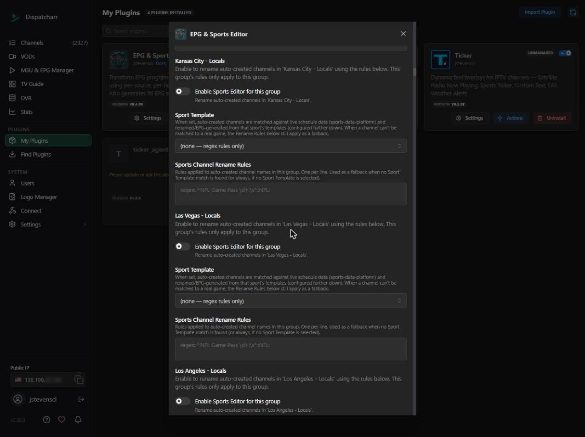
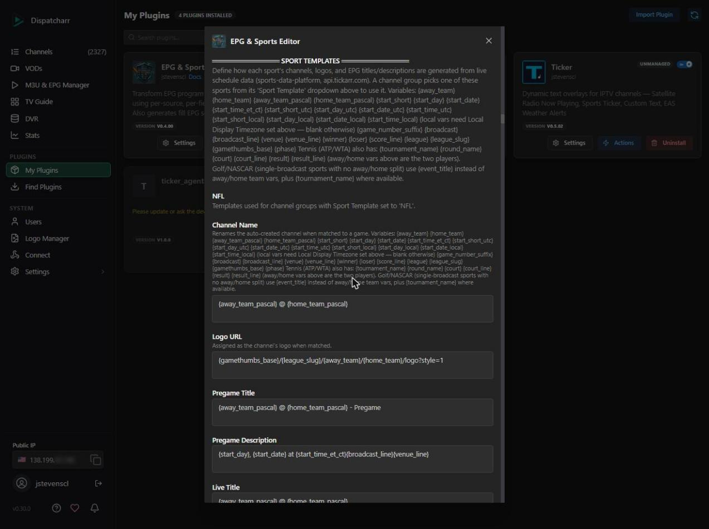
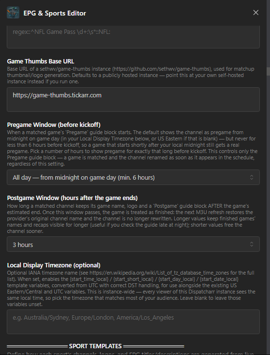
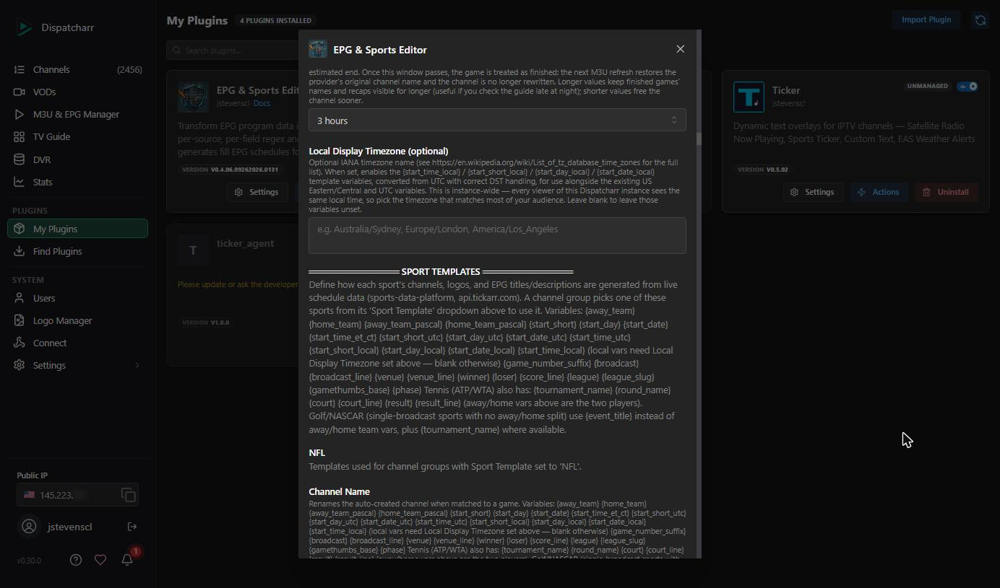

# Sport Templates Guide

A step-by-step walkthrough for turning auto-created sports channels into fully renamed, logo'd channels with real Pregame/Live/Postgame EPG data — driven by a public live sports schedule.

> This feature builds on the [Sports Editor](../README.md#sports-editor)'s per-channel-group Rename Rules. If you haven't set those up yet, do that first — see the README's [Quick Start — Sports Editor](../README.md#quick-start--sports-editor).

---

## How it works, in one paragraph

Dispatcharr's **Auto Channel Sync** creates channels automatically from an M3U stream group (e.g. an "NFL Game Pass" group), usually named whatever the provider calls the stream — often something like `NFL Game Pass 03: Denver Broncos at Atlanta Falcons`. Right after that sync finishes, EPG & Sports Editor parses each auto-created channel's name into an away/home matchup, looks it up against a live public schedule feed ([sports-data-platform](https://api.tickarr.com)), and — if it finds a confident match — renames the channel, assigns it a matchup logo, and writes three real EPG program blocks (Pregame, Live, Postgame) using templates you define once per sport. If no confident match is found, your regular Rename Rules still apply as a fallback.

---

## Prerequisites

1. **Auto Channel Sync configured** in Dispatcharr for the M3U stream group you want (see the main README's Sports Editor Quick Start, Step 1).
2. **Sports Editor enabled for that channel group**, with the toggle on (Settings → find your group's section).
3. That's it — Sport Templates piggyback on the same per-group section; there's no separate enable step.

---

## Step 1 — Enable the Sports Editor for your channel group

In EPG & Sports Editor's Settings tab, scroll to the **SPORTS EDITOR** section. Find your channel group (e.g. "NFL Game Pass Test") and toggle **Enable Sports Editor for this group** on.



## Step 2 — Pick a Sport Template

In that same group's section, set **Sport Template** to the sport this group carries. Leave it at **(none — regex rules only)** if you just want the plain Rename Rules behavior with no live-schedule matching.

EPG & Sports Editor wires up every league sports-data-platform exposes with real event history (confirmed against SDP's own league registry as of 2026-08-16) — see [Full League List](#full-league-list) below for the complete set of 93 leagues across soccer, baseball, softball, volleyball, basketball, football, tennis, golf, motorsports, MMA, boxing, darts, and more.

> **Two different matching engines run under the hood, per sport.** Most sports are "matchup" sports — the channel name is split into two competitors (`Team A @ Team B`, `Player A vs Player B` for tennis/UFC) and each side is matched independently. Golf (PGA TOUR/LPGA), NASCAR, Formula 1, World Surf League, and Sport Fishing Championship are "single-title" sports — there's no two-sided split; SDP has one descriptive broadcast-feed title per event (e.g. `FedEx St. Jude Championship: McIlroy Group (Third Round)`), and matching is fuzzy title scoring instead. You don't need to configure this — it's automatic per sport — but it explains why single-title templates use `{event_title}` instead of `{away_team_pascal}`/`{home_team_pascal}`, and why that matching is inherently more heuristic (see [Golf & NASCAR matching caveats](#golf--nascar-matching-caveats) below — the same caveats apply to F1/WSL/fishing).

> **Sport Templates and Rename Rules are not mutually exclusive.** If a channel can't be confidently matched to a real game (wrong team names, no game currently in the schedule window, etc.), your group's Rename Rules still run as a fallback. If a Sport Template match *is* found, the Sport Template's Channel Name always wins over the regex rules for that channel.

## Step 3 — Review (or customize) that sport's templates

Scroll down to the **SPORT TEMPLATES** section — one sub-section per sport, shared across every group that selects it (templates are defined once per sport, not per group). Each sport has 8 fields:

| Field | Used for |
|---|---|
| **Channel Name** | Renames the matched channel |
| **Logo URL** | Assigned as the channel's logo |
| **Pregame Title** / **Pregame Description** | EPG block from the start of the **Pregame Window** through kickoff (see [Pregame and Postgame windows](#pregame-and-postgame-windows)) |
| **Live Title** / **Live Description** | EPG block covering the estimated game window |
| **Postgame Title** / **Postgame Description** | EPG block from the estimated end through the end of the **Postgame Window** |

Every field comes pre-filled with a sensible starter template (see [Starter Templates Per League](#starter-templates-per-league) below) — you don't have to touch anything to get a working result. Customize any field using the `{variable}` syntax described next.



### Pregame and Postgame windows

Two global dropdowns in the Sports Editor section (just above **Local Display Timezone**) control how long a matched channel is treated as "about to start" and "just finished". They apply to every sport and every channel group.



| Setting | Options | Default | What it does |
|---|---|---|---|
| **Pregame Window (before kickoff)** | All day · 0 · 1 · 2 · 3 · 4 · 6 · 12 · 24 hours | **All day** | When the Pregame guide block starts. **All day** = from midnight on game day in your **Local Display Timezone** (US Eastern if that's blank), but never less than **6 hours** before kickoff. A number = exactly that long before kickoff (0 = no Pregame block). |
| **Postgame Window (hours after the game ends)** | 0 · 1 · 2 · 3 · 4 · 6 · 8 · 12 hours | **3 hours** | How long the channel keeps its game name, logo and a "Postgame" block after the game's *estimated* end. |

**What each one does — and doesn't — do**
- The **Pregame Window** only sizes the Pregame *guide block*. A game is matched and its channel renamed as soon as it appears in the schedule (up to 10 days ahead), whatever this is set to.
- The **Postgame Window** is also the cut-off for matching: once *estimated end + Postgame Window* has passed, the game counts as finished and is treated as *no match* (see [the matching engine](#the-matching-engine-explained)). On the next M3U refresh, Auto Channel Sync restores the provider's original channel name and the plugin no longer rewrites it. Example: an 8:00 PM ET NHL game is estimated to end at 10:45 PM ET; with the default 3 hours the channel keeps its game name until 1:45 AM ET, whereas the old fixed 1 hour ended at 11:45 PM ET.
- Both are stored in UTC like everything else; only the "midnight" used by **All day** depends on a timezone.

**Choosing a Pregame Window if you're far from the game's timezone.** "All day" follows *your* midnight, so a US game that kicks off just after your local midnight would get a very short pregame — that's why "All day" has a 6-hour floor. Example, a viewer set to `Pacific/Auckland`:

| US kickoff | = NZ time | Pregame with "All day" |
|---|---|---|
| Fri 7:00 PM ET | Sat 11:00 AM | 11 h |
| Sat 8:00 PM ET | Sun 1:00 PM | 12 h |
| Sat 12:00 PM ET | Sun 5:00 AM | 6 h (floor) |

Choose a fixed number of hours (e.g. **12** or **24**) if you want every game to show the same pregame length regardless of timezone.

## Step 4 — Run it

- **Automatically**: nothing to do — it runs right after every successful M3U refresh, immediately after Rename Rules.
- **Manually / right now**: go to the Actions tab and click **Run Sport Templates Now**. This is the fastest way to test a template change without waiting for the next refresh.

The result message shows per-group match counts and a few example renames:

```
Sports Editor EPG: 3 channel(s) matched to live games across 1 group(s), 3 auto-created channel(s) scanned.
NFL Game Pass Test (NFL): scanned 3, matched 3
  'NFL: Denver Broncos at Atlanta Falcons' -> 'Denver Broncos @ Atlanta Falcons'
  ...
```

> **Note:** On some Dispatcharr versions (a known display-only regression, present since v0.25.0), the result text above doesn't render in the Actions modal even though the action ran and wrote all its data correctly. If clicking **Run Sport Templates** doesn't visibly show anything, click **Show Status** instead to confirm — or just check your TV Guide/Channels list directly.

> **Don't use Dispatcharr's own per-source refresh icon (⟳) in M3U & EPG Manager on the "EPG & Sports Editor: Sports Editor" or "EPG & Sports Editor: Fill" rows.** These sources deliberately have no URL — EPG & Sports Editor writes their program data directly instead of Dispatcharr fetching it — so Dispatcharr's native refresh will always fail with something like "Failed to download EPG data, cannot parse programs." **This is expected and harmless**: it only flips the source's cosmetic Status column to "Error," it never touches or deletes your actual EPG data. Use **Run Sport Templates Now** (or **Fill**, or **Apply Now**) in the plugin's own Actions tab instead — those are the only actions that should ever be used to refresh EPG & Sports Editor-managed data, and running any of them again immediately restores the Status column to "Success."

## Step 5 — Check your TV Guide

Matched channels show up in your TV Guide with the Pregame/Live/Postgame blocks for their real game — including the game-thumbs logo you configured. A channel whose game is still days away will simply show its next-scheduled blocks like any other future EPG entry.

---

## The matching engine, explained

You don't need to understand this to use the feature, but it helps when a channel *doesn't* match the way you expect.

1. **Parsing the matchup.** EPG & Sports Editor splits the channel's current name (after Rename Rules, if any ran first) on the words `@`, `vs`, `v`, or `at` — so `Denver Broncos at Atlanta Falcons` becomes away=`Denver Broncos`, home=`Atlanta Falcons`. If a channel's name doesn't contain one of those separators, it's skipped (no matchup to look up). Provider decoration is then removed from each team's text — from the **start of the away side** and the **end of the home side** only, so a real team name is never altered: feed tags and game numbers (`NCAAF 04:`, `NHL09:`, `US - NHL GAME 03 :`, `(Apple) (MLS) 031 |`, `US| NBA LIVE [BG] 03 [`), leading times (`7:30PM`, `8pm`), trailing times/dates (`@7:00 pm`, `@ 25 Sep 07:00 PM ET`, `SEP 25 - 8:00 PM ET / 1:00 AM UK`), language/feed notes (`(Spanish)`, `(NHLN Feed )`), timestamps, rankings (`#15`, `No. 11`) and underscores (`New_York_City`). A name like `NCAAF01: 7:30PM NC State at Wake Forest` therefore becomes away=`NC State`, home=`Wake Forest`.
2. **Fetching the schedule.** The full live schedule feed from `api.tickarr.com` is cached for 30 minutes, so repeated refreshes don't hammer the API.
3. **Scoring candidates.** Every event in the feed for the selected league is scored against both the away and home team text — comparing **whole words**, ignoring case, accents and punctuation (`Montréal` = `Montreal`, `D.C.` = `DC`). A team text scores full marks if it equals the team's name, abbreviation or short name; a slightly lower score if it is a whole-word *prefix or suffix* of it (`Vancouver` → `Vancouver Whitecaps`, `Everton FC` → `Everton`) — but never a word from the *middle* (`Tennessee` does **not** match `Middle Tennessee Blue Raiders`, `Kennesaw State` does not match `Jacksonville State`); near-identical spellings also count, loose similarity does not (`NYR` ≠ `NYI`). **Both sides must independently score well** — a strong match on one team and a weak/unrelated match on the other is rejected, not averaged into a false positive. When two feed rows score equally, the complete main schedule row wins over a broadcast/watch duplicate, then the row whose away/home order matches your channel name, then the game closest to now. **Spelling differences between your provider and ESPN** (`Southeastern Louisiana` vs `SE Louisiana`, `SC State` vs `South Carolina State`, `Grambling State` vs `Grambling`, `Penn` vs `Pennsylvania`) are bridged by an *alias step*: common short/long forms of a word (`SE`/`Southeastern`, `SC`/`South Carolina`, `St`/`State`/`Saint`, `Pitt`/`Pittsburgh`, `UMass`, …) and an optional trailing "State" are tried, and score just *below* a real match (0.80), so a genuine name match always wins. Guard rails: an alias is only accepted when the *other* team in the game is a real match; it is never used for a side of the channel that has a real match to some team in the same window (so `Colorado State` is not aliased onto `Colorado` while a real Colorado State game exists); and one-word feed names of four letters or fewer (`IOWA`, `OHIO`) match by equality only (`Northern Iowa` does not match `IOWA`). If your provider uses a spelling that still doesn't match, use a **Rename Rule** on that group to rewrite it into ESPN's form first (rules run before matching). Rows whose "team" is a TV-show title (`SEC Inside: Auburn`) are ignored. **ESPN+ watch-feed rows** list home and away in the opposite order of the real scoreboard for US leagues (college football and NHL measured at 61/61 and 35/37; soccer is not reversed), so the plugin detects that per league from the feed and corrects it — a game that only exists as a watch row comes out in your provider's order. Very loose abbreviations (`Man Utd` for Manchester United) may not match — a missed match is safer than renaming the wrong game.
4. **Time window.** Only events starting within roughly the last 20 hours to the next 10 days are considered — wide enough to catch a game that just ended (so a Postgame recap can still show) without matching something from weeks ago.
5. **Dead-game guard.** If the matched game's entire window — including its Postgame block (the **Postgame Window** setting, 3 hours by default) — has already fully elapsed, it's treated as *no match*. This prevents writing EPG data that's already 100% in the past by the time anyone looks at the guide; your Rename Rules fallback applies instead.
6. **No match found?** The channel is left as-is (after Rename Rules, if configured) and simply isn't touched by the Sport Template step. It'll be re-evaluated on the next run — most commonly, this resolves itself once your M3U provider updates the stream to reflect an upcoming game.

**Tennis (ATP/WTA) specifics:** parsing works the same way (`Player A vs Player B`), but two extra things happen automatically: provider "Last, First" name order (e.g. `Djokovic, Novak`) is tried against SDP's "First Last" player names, and common provider noise — numbered feed prefixes (`(CA) (CBC 01) |`), trailing `@ <date/time> - <tournament> :Tennis NN` suffixes — is stripped before matching. **Doubles matches are not supported in this release**: a doubles pairing like `Arevalo M, Pavic M vs Arribage T, Olivetti A` is deliberately left unmatched rather than guessed at, since there's no reliable way to tell which two names belong to the same team without a player-pairing lookup EPG & Sports Editor doesn't have. It'll simply fall through to your Rename Rules, same as any other unmatched channel.

### Golf & NASCAR matching caveats

PGA TOUR and NASCAR use a different matcher entirely, because there's no two-sided "team A vs team B" structure — SDP has one descriptive title per broadcast feed, and providers word the *same* underlying feed wildly differently across ESPN+, Kayo, TSN+, and other providers' naming conventions.

**PGA TOUR uses SDP's `pga` league slug, not `pga-tour`.** This isn't a naming quirk — `pga-tour` is a superseded, no-longer-updating slug (still using an older ESPN-based ingest); `pga` is the one actively fed by SDP's dedicated PGA TOUR broadcast-coverage integration (`pgatour_coverage`), with real round-by-round, group-by-group data including actual player pairings (e.g. `"Featured Groups - R. Fox, S. Theegala & N. Højgaard, C. Morikawa"`). Confirmed directly against live data before wiring this up — an earlier pass had built and validated everything against `pga-tour`, which was already going stale.

**Tournament name lives on a separate row and gets inherited.** Under the `pga` slug, SDP puts the tournament name on one standalone marker row per tournament (e.g. a `"BMW Championship"` row with no round), and every actual round/feed row under that tournament has a blank tournament name of its own. EPG & Sports Editor backfills it forward chronologically (`_inherit_tournament_names`) so every row can be matched and rendered as if it carried its own tournament name. One real limitation from this: if a tournament's marker row has already aged out of SDP's rolling ~2-week feed window while its round/feed rows are still active (happens for a tournament that started before the window began), there's nothing to inherit from and tournament name stays blank for that tournament's rows — matching still works off round + time + feed-type text, just without tournament-name disambiguation for that specific tournament.

This was built and tuned against real examples from ESPN+/Kayo/TSN+, plus real ATP/WTA tennis listings, but it's genuinely heuristic — some things worth knowing:

- **Tournament identity is judged on "distinctive" words only** (sponsor/place names ≥3 characters, hole numbers) — generic words like "Championship", "Round", "Main Feed", and "Tour" (PGA TOUR's own branding, present in nearly every broadcast) are deliberately ignored for this check, since two *different* tournaments sharing that vocabulary was an actual false-positive found during testing (a "Wyndham Championship" stream was matching "FedEx St. Jude Championship" SDP data before this was fixed). A provider stream naming a different tournament/player than what's currently airing will correctly **not** match, rather than risk matching the wrong event.
- **Known residual edge case:** a handful of real PGA TOUR events have names that reduce to *zero* distinctive words once generic vocabulary is stripped — "TOUR Championship" is the clearest example, since its only content word ("Tour") is itself deliberately excluded as generic. For these, the identity check can't help at all, and the time window becomes the sole safeguard against a same-named-round collision with a different tournament. In practice this is low-risk since PGA TOUR events run consecutively with days between them (comfortably outside the ~30h matching window), but it's a real gap, not a solved case, if two events' windows were ever close together.
- **Same-day renaming is assumed.** The time window for golf/NASCAR matching is tight (roughly ±30 hours of right now, wider for tournament-level-only sports), on the premise — confirmed against real Dispatcharr behavior — that these auto-sync stream names get refreshed by the provider the same day the event airs. A stale, not-yet-refreshed channel name for a game/round from several days ago will correctly fail to match rather than attach to today's unrelated event.
- **Generic group names may pick an arbitrary specific feed.** If a provider's channel name just says "Featured Groups" with no player name (some do), and SDP has several distinctly-named "Featured Groups" entries for that round, EPG & Sports Editor will match to *one* of them — right tournament and round, but the specific players named in your EPG description may not be the exact group that stream actually shows. This is a real limitation, not a bug: there's no way to know which specific group a generic-named stream is without the provider naming it.
- **NASCAR has no real Dispatcharr channel-name examples validated yet** at time of writing — the matcher itself was built and tested against SDP's NASCAR schedule shape (one race per broadcast, e.g. `Cook Out 400`, with real network/radio/streaming fields), but real provider auto-sync channel names for NASCAR streams haven't been checked against it the way golf/tennis were. If NASCAR matches don't behave as expected, that's the most likely reason — treat it as less battle-tested than golf/tennis until confirmed against real examples.

**LPGA is supported, but tournament-level only — no round or group data.** LPGA.com's own schedule/leaderboard data is server-side rendered with no underlying API call to hook into (confirmed by direct investigation), so unlike PGA TOUR, SDP's `lpga` league slug does **not** have PGA TOUR's per-round, per-group broadcast-feed granularity ("Main Feed (Round 2)", "Featured Groups", named player pairings, etc.) — it has exactly one schedule row per tournament, with a tournament name and a single start time covering the whole multi-day event. Practically, that means:
- A provider stream naming the right tournament (`CPKC Women's Open`, in any of the naming variations seen for PGA TOUR — sponsor-prefix-dropped, provider feed-numbered, etc.) will correctly match and get renamed/logo'd.
- It **cannot** distinguish which round or which specific group/hole a stream is showing, since SDP doesn't have that data for LPGA — every stream for a given tournament resolves to the same one event, regardless of what round or group the provider's own name says.
- The Live EPG block is sized to span the whole ~4-day tournament (96 hours) rather than a single round, since there's no per-round timing data to size a shorter window against — a deliberate tradeoff given the coarser data, not a bug. Revisit if/when SDP adds round-level LPGA data matching PGA TOUR's.

**Several sports were wired up with zero live events to verify against.** Boxing (Most Valuable Promotions), PFL, Legacy Alliance (MMA), PDC (Darts), College Women's Tennis, College Women's Golf, and World Amateur Golf Council all had zero events in SDP's rolling feed window when added — the matching mode was assigned based on the sport's inherent structure (boxing/MMA/darts are always exactly 2 individual competitors, same shape as tennis; the two golf variants are individual-field tournaments, same shape as PGA TOUR/LPGA), not verified against real data. This should work correctly given how consistently those sport structures hold, but hasn't been confirmed the way golf/tennis/NASCAR/UFC were. **Cornhole (ACL) and Gymnastics (College) were deliberately left out entirely** — cornhole's doubles/singles format and gymnastics' often-more-than-2-teams meet format don't cleanly fit the away/home binary matcher, and there was no live data available to check which shape SDP actually uses for them.

**World Table Tennis (WTT) is a different sport from ATP/WTA tennis and isn't covered by this release.** Real examples in provider feeds (`World Table Tennis · Europe Smash: Day 1 Afternoon`, `Table Tennis WTT Series Yokohama Semi-Finals`) are day/session-based like golf's round structure, not player-vs-player like ATP/WTA — it would need its own single-title-style matcher, not an extension of the tennis one. Not built in this release; the ATP/WTA matcher correctly ignores these (no `vs`/`@` two-sided split to find).

---

## Full League List

Every `league_slug` sports-data-platform exposes with real event history, cross-referenced against SDP's own league registry as of 2026-08-16 — 93 leagues wired into the Sport Template dropdown. "Matchup" sports split the channel name into two competitors; "single-title" sports match one descriptive event title instead (see above). "Person-vs-person" is a matchup sub-type for individual (not team) competitors — tennis, boxing, MMA, darts — that also gets the "Last, First" name-order handling.

**American football:** NFL, NCAA Football, NCAAF *(the feed publishes college football under two slugs — `ncaaf` is the real ESPN scoreboard, `ncaa-football` is an ESPN+ watch feed that is mostly studio/replay programming plus some real games — so **either template searches both** and prefers the scoreboard game; pick whichever you like)*, NFL FLAG, UFL — all matchup

**Basketball:** NBA, WNBA, NCAAM Basketball, NCAAW Basketball, NZNBL — all matchup

**Baseball:** MLB, NCAA Baseball, ALB, WPBL, JLB, INTERLB, Little League Baseball, NECB, SLBASE — all matchup

**Softball:** AUSL, HSSOFT, JLSOFT, Little League Softball, NCAA Softball, SLSOFT — all matchup (zero live events when added — off-season for the college/adult leagues, added on the strength of softball's unambiguous team-vs-team structure, not verified against real data)

**Volleyball:** NCAA Volleyball, NCAA Women's Volleyball, Big Ten Volleyball (W) — all matchup

**Ice hockey:** NHL — matchup

**Field hockey:** Big Ten Field Hockey — matchup

**Australian football:** AFL — matchup

**Lacrosse:** PLL, BHSLAX, GHSLAX, WLL — all matchup

**MMA:** UFC, PFL, Legacy Alliance — matchup, person-vs-person

**Boxing:** Most Valuable Promotions — matchup, person-vs-person

**Darts:** PDC — matchup, person-vs-person

**Tennis:** ATP, WTA, CWTEN (College Women's Tennis) — matchup, person-vs-person

**Golf:** PGA TOUR (`pga` slug — see caveat above, not `pga-tour`), LPGA, CWGOL (College Women's Golf), WAGC (World Amateur Golf Council) — all single-title (LPGA/CWGOL/WAGC are tournament-level only)

**Motorsports:** NASCAR Cup Series, NASCAR Xfinity Series, NASCAR Craftsman Truck Series, Formula 1 — all single-title

**Surfing:** World Surf League — single-title

**Fishing:** Sport Fishing Championship — single-title

**Soccer** (all matchup): MLS, Premier League, EFL Championship, EFL League One, EFL League Two, Carabao Cup, Community Shield, La Liga, LALIGA, LALIGA 2, Bundesliga, 3. Liga, Ligue 1, Serie A, Liga Portugal, Eredivisie, Süper Lig, Scottish Premiership, Liga MX, USL Championship, USL League One, USL Cup, Leagues Cup, NWSL, Northern Super League, J1 League, Brasileirão Série A, Copa Libertadores, Copa Sudamericana, Argentine Primera División, NCAAW Soccer, NCAAM Soccer, Big Ten Soccer (W), Big Ten Soccer (M), FIFA World Cup, UEFA Champions League, UCL Qualifying, UECL Qualifying, UEL Qualifying, Men's International Friendly

> **"La Liga" vs "LALIGA" vs "LALIGA 2" — this isn't a naming mistake, it's two different SDP ingest sources that haven't been merged.** `la-liga` and `laliga` both claim to be the same Spanish top flight, just via different underlying feeds — both are included as-is rather than guessed at. If one of a pair sits empty for your provider's channel names, just don't enable Sports Editor for a group against that one.

**Not included:**
- **World Table Tennis (WTT)** — different sport from ATP/WTA, needs its own matcher, not built (see above).
- **Mecum Auctions** — SDP files this under its `motor-sports` category, but it's a car auction livestream, not a sport. Deliberately excluded.
- **Cornhole (ACL) and Gymnastics (College)** — deliberately held back; their real-world formats (doubles/singles cornhole, multi-team gymnastics meets) don't obviously fit the away/home binary matcher, and there was no live data to check which shape SDP actually uses (see caveat above).
- **`pga-tour` (the old golf slug)** — superseded by `pga`, no longer updating. Not wired in on purpose (see PGA TOUR caveat above).

---

## Full Variable Reference

All of these are available in every template field (Channel Name, Logo URL, and all six title/description fields):

| Variable | Example | Notes |
|---|---|---|
| `{away_team}` | `den` | URL-safe slug — the team abbreviation, lowercased (for NCAAF / NCAA Football the full team name, e.g. `air-force-falcons`, since game-thumbs rejects some of ESPN's college abbreviations) — use in Logo URL |
| `{home_team}` | `atl` | Same, for the home team |
| `{away_team_pascal}` | `Denver Broncos` | Full readable team name — use in titles/descriptions |
| `{home_team_pascal}` | `Atlanta Falcons` | Same, for the home team |
| `{start_short}` | `7:00 PM` | Kickoff time, Eastern |
| `{start_day}` | `Friday` | Day of week, Eastern |
| `{start_date}` | `Aug 14` | Month + day, Eastern |
| `{start_time_et_ct}` | `7:00 PM ET / 6:00 PM CT` | Both US timezones in one string |
| `{start_short_utc}` | `11:00 PM` | Kickoff time, UTC — timezone-neutral alternative to `{start_short}` |
| `{start_day_utc}` | `Friday` | Day of week, UTC |
| `{start_date_utc}` | `Aug 14` | Month + day, UTC |
| `{start_time_utc}` | `11:00 PM UTC` | Timezone-neutral alternative to `{start_time_et_ct}` |
| `{start_short_local}` | `9:00 AM` | Kickoff time in your configured **Local Display Timezone** setting — blank if that setting is empty |
| `{start_day_local}` | `Saturday` | Day of week, local timezone — blank if unset |
| `{start_date_local}` | `Aug 15` | Month + day, local timezone — blank if unset |
| `{start_time_local}` | `9:00 AM AEST` | Local time with the zone's abbreviation — blank if unset |
| `{game_number_suffix}` | ` (Game 2)` | Blank unless the feed marks a game number (doubleheaders, etc.) |
| `{broadcast}` | `ESPN Unlmtd, KUSA-TV (9NEWS)` | Raw broadcast field from the feed, blank if unknown |
| `{broadcast_line}` | ` on ESPN Unlmtd, KUSA-TV (9NEWS)` | Pre-formatted with leading " on " — blank (not just empty) when no broadcast info exists, so your sentence doesn't end with a dangling " on " |
| `{venue}` | `Mercedes-Benz Stadium, Atlanta` | Venue name + city, blank if unknown |
| `{venue_line}` | ` at Mercedes-Benz Stadium, Atlanta` | Pre-formatted with leading " at " |
| `{winner}` | `Denver Broncos` | Blank until the game has a final score |
| `{loser}` | `Atlanta Falcons` | Same |
| `{score_line}` | `Final: Denver Broncos 24 - Atlanta Falcons 17` | Blank until the game has a final score — used in Postgame Description |
| `{league}` | `NFL` | Full league name from the feed |
| `{league_slug}` | `nfl` | Short slug — matches the game-thumbs league path |
| `{gamethumbs_base}` | `https://game-thumbs.tickarr.com` | Your configured Game Thumbs Base URL, trailing slash stripped |
| `{phase}` | `pregame` / `live` / `postgame` | Which of the three blocks is being rendered — mostly useful if you want one shared template across phases |
| `{event_title}` | `FedEx St. Jude Championship: McIlroy Group (Third Round)` | **Golf/NASCAR only.** The one descriptive broadcast-feed title — use this instead of `{away_team_pascal}`/`{home_team_pascal}`, which don't apply (no away/home split for these sports) |
| `{tournament_name}` | `Cincinnati Open` | **Tennis only.** Blank for every other sport |
| `{round_name}` | `Round 2` | **Tennis only.** Blank for every other sport |
| `{court}` | `P&G Stadium Court` | **Tennis only.** Populated on roughly 30% of matches (not every court is reported) — blank otherwise |
| `{court_line}` | ` on P&G Stadium Court` | Pre-formatted with leading " on ", blank (not just empty) when court is unknown |
| `{result}` | `Novak Djokovic bt Thiago Agustin Tirante 6-2 6-4` | **Tennis only.** Free-text final result — tennis doesn't use the numeric `{score_line}` team sports do, since SDP reports it as text |
| `{result_line}` | ` — Novak Djokovic bt Thiago Agustin Tirante 6-2 6-4` | Pre-formatted with a leading " — ", blank until the match has a result |
| `{feed_tag}` | `HOME` | Populated when your provider runs separate regional-broadcast channels for the same game, tagged `HOME`/`AWAY`/`NATIONAL` right before the date/time in the raw auto-sync name (e.g. `... Baltimore Orioles HOME 23 Aug 01:35 PM ET`) — confirmed on MLB, and the same shape applies to any matchup sport (NBA, NFL, etc.) whose provider tags feeds this way. Blank for every other provider. |
| `{feed_line}` | ` (Home Feed)` | Pre-formatted from `{feed_tag}` — blank (not just empty) when there's no feed tag, so a shared Channel Name template doesn't grow a dangling suffix for providers that don't split feeds |

**Tip:** `{broadcast_line}` and `{venue_line}` already include their own leading space and connector word — just append them directly to a sentence, don't add your own " on " / " at " in front of them.

**UTC vs. ET/CT — what's actually timezone-dependent and what isn't:**
- The **stored program times** (where each block starts/ends in your TV Guide) are always UTC, same as everything else in Dispatcharr's database — this is fully timezone-neutral and works correctly for viewers anywhere in the world regardless of which time-format variables you use in your templates. The schedule feed's game times, the matching window and the game start/end are all UTC too. The one place a timezone enters the *placement* of a block is the default **All day** Pregame Window, whose "midnight" is taken in your Local Display Timezone (US Eastern if blank) — see [Pregame and Postgame windows](#pregame-and-postgame-windows).
- The **`{start_short}` / `{start_day}` / `{start_date}` / `{start_time_et_ct}` variables** are US Eastern/Central-formatted text, since that's the broadcast-standard convention for the leagues SDP covers (NFL, NBA, MLB, NHL, NCAA, MLS are all US sports). Use the `_utc` variants (`{start_short_utc}`, `{start_day_utc}`, `{start_date_utc}`, `{start_time_utc}`) instead if you'd rather your titles/descriptions read in UTC.
- If your audience is mostly outside the US, set **Local Display Timezone** (in the Sports Editor section, an IANA zone name like `Europe/London` or `Australia/Sydney`) to unlock the `_local` variants (`{start_short_local}`, `{start_day_local}`, `{start_date_local}`, `{start_time_local}`) — DST-correct, unlike doing arithmetic on a UTC string. This is one setting for the whole Dispatcharr instance, not per-viewer: every viewer sees the same local time, since these EPG titles/descriptions are generated once server-side rather than rendered per-viewer at watch time. Leave it blank (the default) and the `_local` variables just render as empty strings — every existing template using only `_utc`/`_et_ct` is unaffected.



---

## Game Thumbs & Logo URL Parameters

The default Logo URL template uses [sethwv/game-thumbs](https://github.com/sethwv/game-thumbs), a self-hostable matchup logo/thumbnail API:

```
{gamethumbs_base}/{league_slug}/{away_team}/{home_team}/logo?style=1
```

- **`{gamethumbs_base}`** — set once in **Settings → Sports Editor → Game Thumbs Base URL**. Defaults to a publicly hosted instance; point it at your own self-hosted instance if you run one.
- **`{league_slug}`** — the sport's league path (`nfl`, `nba`, `mlb`, `nhl`, `ncaa-football`, `mls`).
- **`{away_team}` / `{home_team}`** — team slugs: the abbreviation (`den`, `atl`, etc.) for most leagues, and the full team name (`air-force-falcons`) for college football, where ESPN's abbreviations (`AFA`, `MTSU`, …) aren't all known to game-thumbs. A few very small schools aren't in game-thumbs at all and can't get a logo.
- **`?style=1`** — game-thumbs supports multiple visual styles; check its README for the current list and swap the number to taste. You can also use its `/thumb` endpoint instead of `/logo` for a wider matchup graphic instead of a single team crest — e.g. `{gamethumbs_base}/{league_slug}/{away_team}/{home_team}/thumb`.

### Using the public default instance

Nothing to do — **Game Thumbs Base URL** already defaults to a publicly hosted instance, and Logo URL templates work out of the box. This is fine for most users; skip straight to [Starter Templates Per League](#starter-templates-per-league).

### Self-hosting your own game-thumbs instance

Reasons to self-host: you want guaranteed uptime independent of a third party, you're customizing thumbnail styles, or you just prefer not depending on an external service for something that shows up in your guide constantly.

1. **Deploy the container.** [sethwv/game-thumbs](https://github.com/sethwv/game-thumbs) ships a standard Docker image — follow its own README for the current `docker run` / `docker-compose.yml` invocation. A minimal setup is a single container exposing its HTTP port; no database or persistent volume is required.
2. **Make it reachable from wherever your guide renders.** This is the detail people miss: the URL needs to be reachable not just from the Dispatcharr *server*, but from every device/browser/app that actually displays your TV guide (since the guide client fetches the logo image directly, not proxied through Dispatcharr). A container port only reachable inside your home network won't work for a phone on cellular data, for example. Options, roughly in order of effort:
   - **Reverse proxy + real domain** (what EPG & Sports Editor's own public default instance uses): put the container behind Caddy/Nginx/Traefik on a subdomain, with a real TLS cert.
   - **Cloudflare Tunnel**: no port-forwarding or public IP needed, works well for a home server. Give the tunnel its own isolated Docker network from your other services if you're running multiple containers, so a compromise of one doesn't expose the others.
   - **LAN-only**: fine if every device viewing your guide is always on the same network (e.g. a single Plex/Jellyfin server on your home LAN with no remote access) — just use the container's local IP/port directly.
3. **Point EPG & Sports Editor at it.** Settings → Sports Editor → **Game Thumbs Base URL** → your instance's base URL (no trailing slash, e.g. `https://game-thumbs.example.com`). This one setting applies to every sport's Logo URL template, since they all reference `{gamethumbs_base}`.
4. **Verify it.** Open `{your-base-url}/nfl/kc/buf/logo?style=1` (swap in any real team abbreviations) directly in a browser — you should get an image back, not an error. If that works, click **Run Sport Templates Now** and check a matched channel's logo in Channels or the TV Guide.

---

## Starter Templates Per League

These are the built-in defaults — a good base to start from and adjust. The six original team sports share the same Channel Name and Logo URL pattern; only the assumed game duration (used to size the Live block) differs under the hood. Tennis and golf/NASCAR use their own starting points, since they don't have an away/home matchup shape.

### NFL / NBA / MLB / NHL / NCAA Football / MLS (shared starting point)

| Field | Default template |
|---|---|
| Channel Name | `{away_team_pascal} @ {home_team_pascal}` |
| Logo URL | `{gamethumbs_base}/{league_slug}/{away_team}/{home_team}/logo?style=1` |
| Pregame Title | `{away_team_pascal} @ {home_team_pascal} - Pregame` |
| Pregame Description | `{start_day}, {start_date} at {start_time_et_ct}{broadcast_line}{venue_line}` |
| Live Title | `{away_team_pascal} @ {home_team_pascal}` |
| Live Description | `Live: {away_team_pascal} at {home_team_pascal}{broadcast_line}{venue_line}` |
| Postgame Title | `{away_team_pascal} @ {home_team_pascal} - Final` |
| Postgame Description | `{score_line}{venue_line}` |

### ATP / WTA (tennis)

| Field | Default template |
|---|---|
| Channel Name | `{away_team_pascal} vs {home_team_pascal}` |
| Logo URL | *(blank — game-thumbs doesn't have player crests; set your own if you have a source)* |
| Pregame Title | `{away_team_pascal} vs {home_team_pascal} - {round_name}` |
| Pregame Description | `{tournament_name}{court_line}, {start_day} {start_date} at {start_time_et_ct}{broadcast_line}` |
| Live Title | `{away_team_pascal} vs {home_team_pascal}` |
| Live Description | `Live: {tournament_name} {round_name}{court_line}{broadcast_line}` |
| Postgame Title | `{away_team_pascal} vs {home_team_pascal} - Final` |
| Postgame Description | `{result}{court_line}` |

### PGA TOUR / LPGA / NASCAR (single-title sports — no away/home split)

| Field | Default template |
|---|---|
| Channel Name | `{event_title}` |
| Logo URL | *(blank — game-thumbs doesn't cover golf/NASCAR)* |
| Pregame Title | `{event_title} - Pregame` |
| Pregame Description | `{start_day}, {start_date} at {start_time_et_ct}{broadcast_line}{venue_line}` |
| Live Title | `{event_title}` |
| Live Description | `Live: {event_title}{broadcast_line}{venue_line}` |
| Postgame Title | `{event_title} - Final` |
| Postgame Description | `{score_line}{venue_line}` |

### Estimated game/match duration (sizes the Live block only — not user-editable, informational)

| League | Assumed duration |
|---|---|
| NFL | 3.5 hours |
| NBA | 2.5 hours |
| MLB | 3.25 hours |
| NHL | 2.75 hours |
| NCAA Football | 3.5 hours |
| MLS | 2.25 hours |
| ATP | 2.5 hours |
| WTA | 2.0 hours |
| PGA TOUR | 5.5 hours |
| LPGA | 96 hours (~4 days — tournament-level data only, see caveat above) |
| NASCAR Cup Series | 3.5 hours |
| NASCAR Xfinity Series | 3.0 hours |
| NASCAR Craftsman Truck Series | 2.5 hours |

Tennis match length varies enormously in reality (a straight-sets match can finish in under an hour, a five-setter can run well past three) — the 2.0–2.5 hour estimate is a rough middle ground, not a real prediction; expect the Live block to sometimes run short or long relative to the actual match.

The remaining ~80 leagues (soccer, softball, basketball, lacrosse, boxing/MMA/darts, and the smaller golf/motorsport variants) aren't listed individually here — each uses a reasonable estimate for its sport category (soccer/most team sports ≈2.25h, baseball/softball ≈2.5–3.25h, boxing/MMA/darts ≈1h broadcast-slot, tournament-level golf variants ≈96h same as LPGA) rather than a researched per-league figure. None of these are load-bearing for correctness — they only affect how long the Live EPG block runs, not whether a channel matches.

Every game gets a Pregame block before kickoff and a Postgame block after the estimated end, regardless of league. How long each lasts is set by the **Pregame Window** (default: all day from midnight on game day, at least 6 hours) and **Postgame Window** (default: 3 hours) settings — see [Pregame and Postgame windows](#pregame-and-postgame-windows). All stored times are UTC, since Dispatcharr itself is timezone-neutral and EPG & Sports Editor is used by viewers worldwide; only the "midnight" used by the default Pregame Window follows your Local Display Timezone (US Eastern if blank).

### Ideas for customizing per league

- **NCAA Football** — team names can be long; consider a shorter Channel Name like `{away_team_pascal} @ {home_team_pascal}` if your guide truncates titles. (`{away_team}` / `{home_team}` are full-name slugs for college football, so they're not short — see the variable table.)
- **MLB** — add `{game_number_suffix}` to Channel Name to distinguish doubleheaders: `{away_team_pascal} @ {home_team_pascal}{game_number_suffix}`.
- **Any league with separate HOME/AWAY regional feeds** — add `{feed_line}` to Channel Name so both feeds don't collide on an identical name: `{away_team_pascal} @ {home_team_pascal}{feed_line}` → `Tampa Bay Rays @ Baltimore Orioles (Home Feed)`.
- **Any league** — swap `@` for `vs.` in Channel Name if you prefer that convention: `{away_team_pascal} vs. {home_team_pascal}`.

---

## Troubleshooting

**A channel never gets matched.**
Run **Run Sport Templates Now** and check the result message — it reports scanned vs. matched counts per group. Common causes: the channel's raw/renamed name doesn't contain a recognizable `@`/`vs`/`at` separator; the two team names are too different from the feed's naming (try checking the raw provider name against team abbreviations); or there's simply no game for that exact matchup in the current schedule window (most common for a channel representing a game that already happened days ago and won't recur soon).

**A channel matched, but nothing shows in the TV Guide.**
Check the game's actual kickoff time — if the entire Pregame→Postgame window has already passed, EPG & Sports Editor intentionally skips it rather than writing dead data (see [step 5 of the matching engine](#the-matching-engine-explained)). It'll pick up the channel's next real game automatically once your M3U provider updates the stream.

**Logo doesn't load.**
Confirm your Game Thumbs Base URL is reachable from wherever your player renders the guide (not just from the Dispatcharr server) — if you're self-hosting game-thumbs, it needs to be publicly reachable, not just container-internal.

**I changed a template and want to see the new EPG text without waiting.**
Click **Run Sport Templates Now** — it always regenerates all three blocks fresh for every currently-matched channel using your latest saved templates.

**Clicking the refresh icon (⟳) next to "EPG & Sports Editor: Sports Editor" in M3U & EPG Manager gives an error about the source URL.**
Expected — see the note in [Step 4](#step-4--run-it) above. That row intentionally has no URL. Use **Run Sport Templates Now** in the plugin's Actions tab instead; your real EPG data was never affected.

**I get a "failed to update plugin settings: 400" error when running Sport Templates actions.**
Fixed in v0.4.03 — see the README FAQ. The action itself still completed and your data was written; update the plugin to clear the spurious error.

---

## Credits

- The per-sport template UX (Channel Name / Logo URL / Pregame / Live / Postgame fields) was inspired by [Pharaoh-Labs' Teamarr](https://github.com/Pharaoh-Labs/teamarr), used with permission.
- Matchup logos/thumbnails via [sethwv/game-thumbs](https://github.com/sethwv/game-thumbs) (MIT), used with permission.
- Schedule data via [sports-data-platform](https://api.tickarr.com).
